# 🍎 FruitNet: Advanced Fruit Classification using Custom Architecture, Competitive Activation Function, and Fruit Discrimination Loss

## Project Overview

FruitNet is a deep learning framework designed for high-performance fruit classification using transfer learning and custom deep learning components. The project combines a novel neural architecture with a custom activation function and a custom loss function to improve classification accuracy, feature representation, and model robustness.

The framework is trained on the Fruit Recognition Dataset and classifies 15 fruit categories with high accuracy while providing explainability and bias analysis.

### Key Contributions

1. **Competitive Activation Function (CAF)**
2. **Fruit Discrimination Loss (FDL)**
3. **FruitNet Architecture**
4. **GradCAM Explainability**
5. **Bias and Robustness Analysis**

---

# Motivation

Fruit classification is an important problem in agricultural automation, quality inspection, inventory management, and smart retail systems.

Traditional approaches generally use:

* Standard CNN architectures
* ReLU activation functions
* Cross Entropy Loss

These methods often suffer from:

* Poor class separability
* Limited feature diversity
* Confusion between visually similar fruits
* Weak focus on discriminative regions
* Reduced robustness under class imbalance

FruitNet addresses these challenges through custom mathematical formulations and architectural enhancements.

---

# Dataset Information

Dataset: Fruit Recognition Dataset

Dataset Source:

https://www.kaggle.com/datasets/chrisfilo/fruit-recognition

### Dataset Statistics

| Property         | Value         |
| ---------------- | ------------- |
| Total Images     | 70,549        |
| Classes          | 15            |
| Input Resolution | 224 × 224 × 3 |

### Fruit Categories

* Apple
* Banana
* Carambola
* Guava
* Kiwi
* Mango
* Orange
* Peach
* Pear
* Persimmon
* Pitaya
* Plum
* Pomegranate
* Tomatoes
* Muskmelon

### Dataset Split

| Split      | Images |
| ---------- | ------ |
| Train      | 56,439 |
| Validation | 7,055  |
| Test       | 7,055  |

---

# Dataset Analysis

Comprehensive exploratory analysis was performed before training.

### Analyses Conducted

* Class Distribution Analysis
* Image Resolution Analysis
* RGB Distribution Analysis
* Dataset Imbalance Analysis
* Sample Visualization

### Observations

* Largest Class: Guava
* Smallest Class: Persimmon
* Imbalance Ratio: 9.51

### Dataset Visualizations

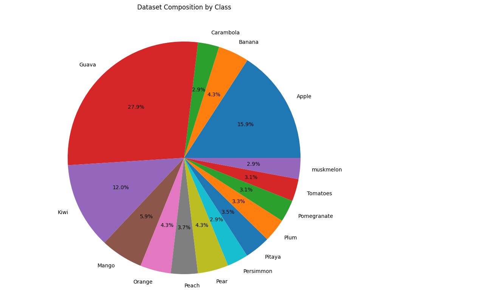

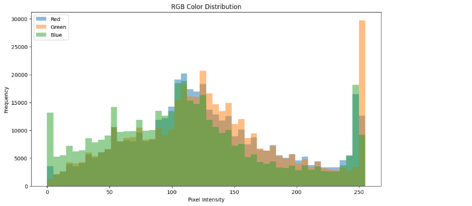

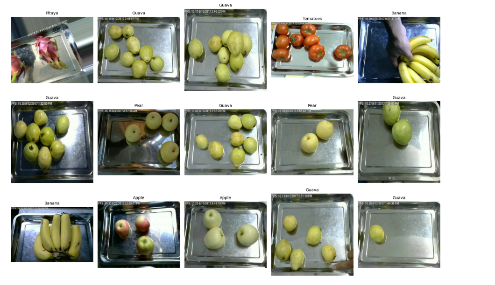

# Proposed FruitNet Architecture

## Architecture Pipeline

Input Image

↓

MultiScale Block

├── 3×3 Convolution

├── 5×5 Convolution

└── 7×7 Convolution

↓

Attention Block

↓

Channel Adapter

↓

Pretrained VGG16 Backbone

↓

Competitive Activation Function (CAF)

↓

Global Average Pooling

↓

Embedding Layer

↓

Classifier

↓

Output

---

## MultiScale Block

The MultiScale Block extracts features at different spatial resolutions simultaneously.

### Purpose

Different fruits contain features at different scales:

* Surface texture
* Shape boundaries
* Stem regions
* Color transitions

Using multiple convolution kernels allows the network to capture both local and global information.

### Benefits

* Better feature diversity
* Improved representation learning
* Stronger generalization

---

## Attention Block

The attention module enables the network to focus on the most discriminative image regions.

### Examples

* Fruit boundaries
* Texture variations
* Shape characteristics
* Color transitions

### Benefits

* Reduced background influence
* Better localization
* Improved classification performance

---

## Channel Adapter

The Channel Adapter aligns custom feature maps with the pretrained VGG16 backbone.

### Purpose

* Smooth feature integration
* Efficient transfer learning
* Reduced feature mismatch

---

# Competitive Activation Function (CAF)

## Motivation

ReLU is widely used due to its simplicity.

However, ReLU has several limitations:

* Dead neurons
* Hard zero region
* Limited feature amplification

CAF was developed to provide adaptive feature enhancement while maintaining differentiability.

## Mathematical Formulation

CAF is defined as:

f(x) = x × (1 + α × (x² / (1 + x²)))

where:

* x = input feature
* α = trainable parameter

Initial α = 0.5

Trainable = Yes

## Properties

* Fully differentiable
* Smooth gradients
* Adaptive amplification
* Learnable non-linearity

## Advantages

* Richer feature representation
* Better gradient propagation
* Enhanced optimization dynamics

---

# Fruit Discrimination Loss (FDL)

## Motivation

Cross Entropy Loss focuses only on classification accuracy.

It does not explicitly encourage:

* Confidence separation
* Strong feature embeddings

FDL addresses these issues.

## Components

FDL consists of:

Total Loss =
CrossEntropy +
λ₁ × Gap Loss +
λ₂ × Feature Loss

### Cross Entropy Loss

Provides standard classification supervision.

### Gap Loss

Gap Loss encourages separation between the top two predicted probabilities.

Gap Loss = max(0, Margin − (p₁ − p₂))

where:

* p₁ = highest probability
* p₂ = second highest probability

Benefits:

* Reduced ambiguity
* Increased confidence

### Feature Loss

Feature Loss improves embedding quality.

Benefits:

* Better inter-class separation
* More robust features
* Stronger representation learning

---

# Training Strategy

## Phase 1

Frozen:

* Entire VGG16 Backbone

Trainable:

* MultiScale Block
* Attention Block
* Channel Adapter
* CAF
* Embedding Layer
* Classifier

### Results

Validation Accuracy: 92.83%

Validation F1 Score: 92.94%

---

## Phase 2

Trainable:

* Last VGG16 Block
* All Custom Layers

### Results

Validation Accuracy: 98.82%

Validation F1 Score: 98.83%

Validation Loss: 0.1485

---

## Phase 3

Trainable:

* Entire Network

Status: Experimental

---

# Experimental Results

| Metric              | Phase 1 | Phase 2 |
| ------------------- | ------- | ------- |
| Validation Accuracy | 92.83%  | 98.82%  |
| Validation F1 Score | 92.94%  | 98.83%  |
| Validation Loss     | 0.3291  | 0.1485  |

Accuracy Improvement:

+5.99%

---

# Team Contributions

## Member 1 – Harsh Kumar Singh (MC25B1003)

### Competitive Activation Function (CAF)

Responsibilities:

* CAF Design
* Dataset Analysis
* Data Pipeline
* Training Utilities

---

## Member 2 – Abhishek Agrawal (AD25B1002)

### Fruit Discrimination Loss (FDL)

Responsibilities:

* Loss Design
* Fine-Tuning Strategy
* Hyperparameter Selection
* Experimental Analysis

---

## Member 3 – Dipendra Vikram Singh (CS25B1015)

### FruitNet Architecture

Responsibilities:

* MultiScale Block
* Attention Block
* Evaluation
* GradCAM
* Bias Analysis

---

# Technologies Used

* Python
* PyTorch
* Torchvision
* NumPy
* Pandas
* OpenCV
* Matplotlib
* Scikit-Learn
* TensorBoard

---

# Current Best Result

Validation Accuracy: **98.82%**

Validation F1 Score: **98.83%**

Model:

**FruitNet + CAF + FDL**
# Visual Results Gallery

## Training Accuracy

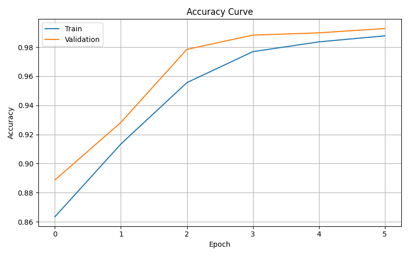

## Training Loss

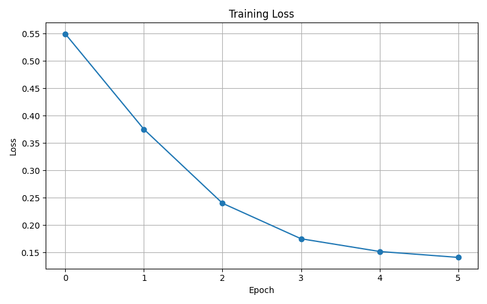

## Validation Loss

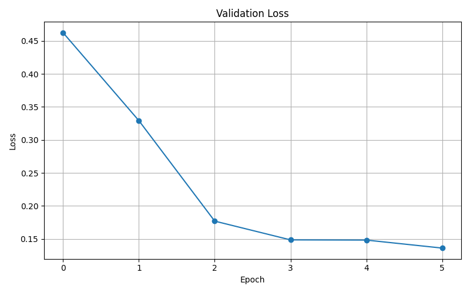

## Final Metrics

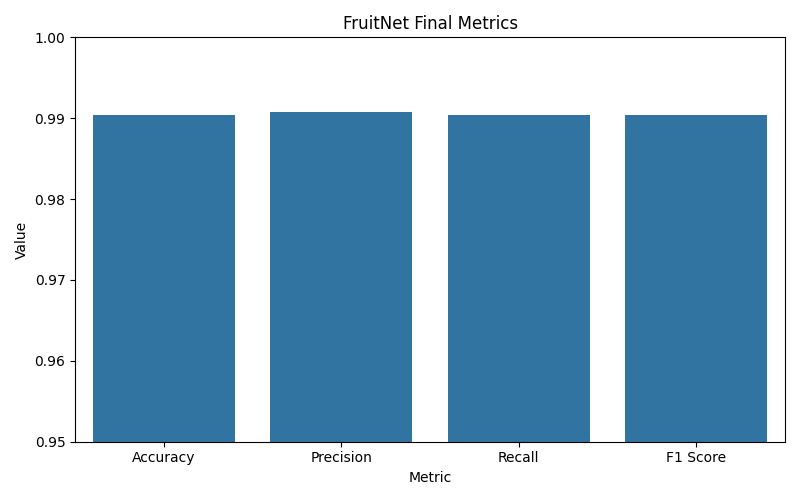

## Baseline vs FruitNet

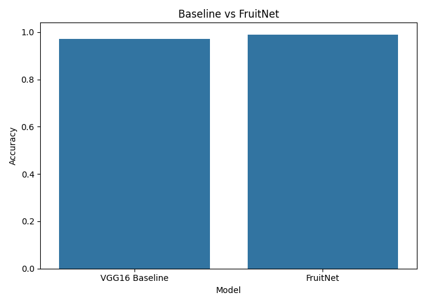

## Confusion Matrix

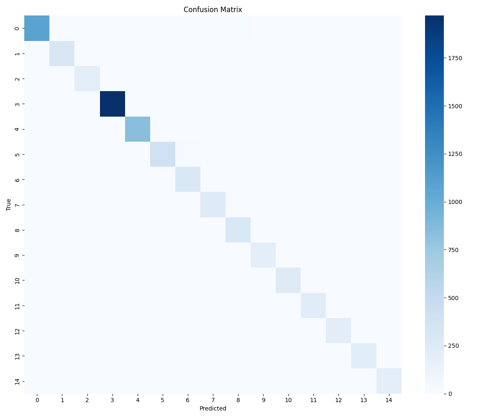

## ROC Curves

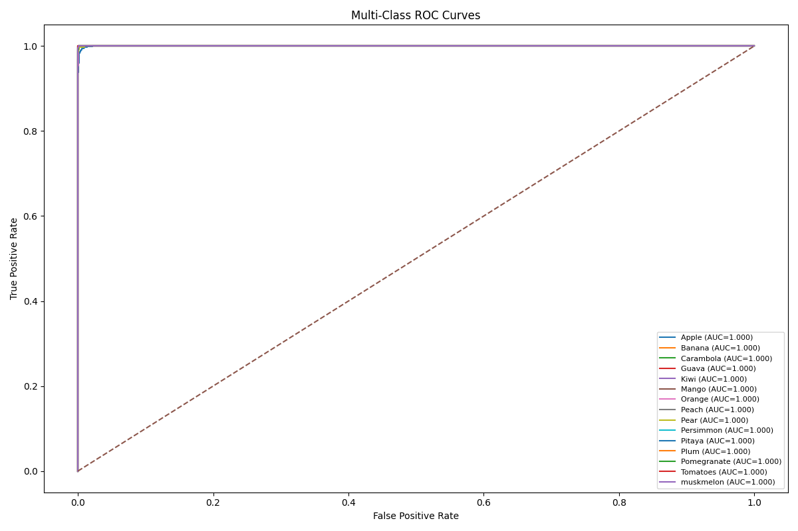

## Ablation Accuracy

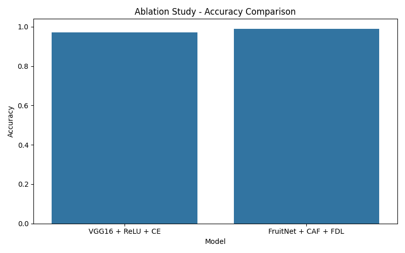

## Ablation F1 Score

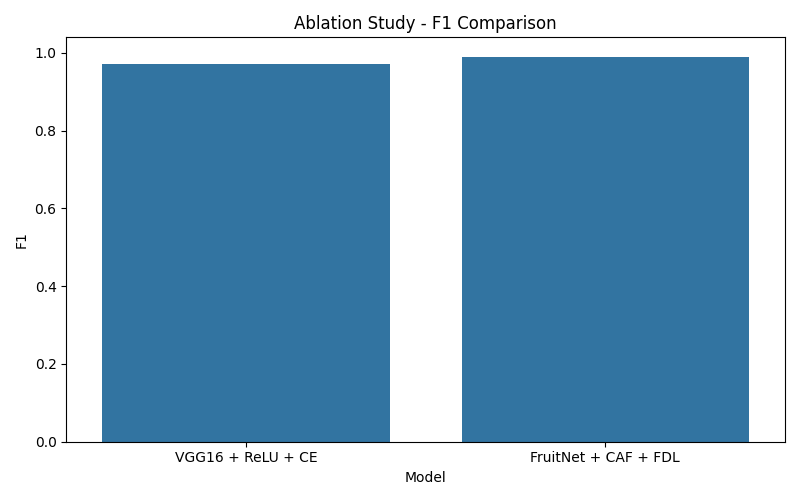

## GradCAM Visualization

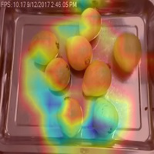

